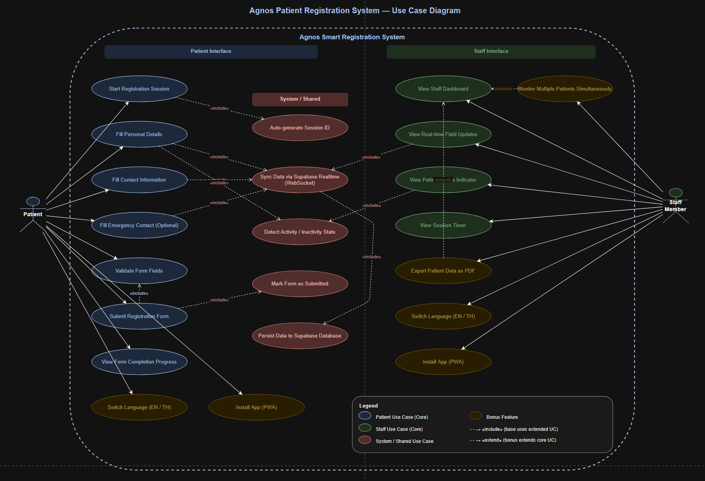

# Agnos Smart Registration System

A real-time patient registration system built for Agnos Health. Patients fill in their information on a self-service form while hospital staff monitor all sessions live on a dashboard — no page refresh needed.

**Live Demo:** [https://agnos-registration.vercel.app](https://agnos-registration.vercel.app)

---

## Features

### Patient Side
- Multi-section registration form — Personal, Contact, Additional, Emergency
- Real-time sync to database as patient types (debounced 400ms)
- Session persistence — refresh the page and continue where you left off
- Post-submit editing — patients can correct mistakes after submitting
- Progress bar showing form completion percentage
- Client-side validation with helpful error messages
- Searchable dropdowns for nationality, country code, language, religion
- All ASEAN countries included
- Bilingual — English and Thai (ภาษาไทย)
- PWA installable — adds to home screen

### Staff Side
- Real-time dashboard — sessions appear and update instantly
- Card view and table view toggle
- Filter by patient name, gender, and nationality
- Session lifecycle tracking (Filling → Inactive → Expired → Submitted)
- Auto-expire sessions inactive for 30+ minutes
- Manually mark sessions as expired or delete them (we should handle RBAC for that kind of actions in real life projects. i added them for demo purpose)
- Confirmation dialogs for destructive actions
- PDF export per patient
- Toast notifications for new patients, submissions, and actions
- Mobile-optimized — simplified table columns on small screens

---

## Tech Stack

| Technology | Purpose | Version |
|---|---|---|
| Next.js | React framework with App Router | 16.1.6 |
| TypeScript | Type safety | ^5 |
| Tailwind CSS | Utility-first styling | ^4 |
| Supabase | Realtime database + RLS | ^2.98.0 |
| React Hook Form | Form state management | ^7.71.2 |
| Zod | Schema validation | ^4.3.6 |
| next-intl | Internationalization (EN/TH) | ^4.8.3 |
| next-pwa | Progressive Web App | ^5.6.0 |
| jsPDF | PDF export | ^4.2.0 |

### Why Supabase over Socket.io?

Socket.io requires a persistent Node.js server which cannot run on Vercel's serverless infrastructure — it would need a separate deployment on Railway or Render, adding cost and complexity. Supabase Realtime provides WebSocket-based live updates built on PostgreSQL's `LISTEN/NOTIFY`, works on serverless with zero extra infrastructure, and includes database + RLS security in the same service.

---

## Use Case Diagram


---

**Use Case Diagram:** [Link](https://drive.google.com/file/d/1mqRGLdjw8dYv_py6ULmone8HA3dJQFfK/view?usp=drive_link)


## Session Lifecycle

```
Patient opens form
        │
        ▼
   [ filling ]  ◄──── Patient is actively typing (activity < 30s)
        │
        │  No activity for 30s
        ▼
  [ inactive ]  ◄──── Patient paused (30s – 30min)
        │
        │  No activity for 30min
        ▼
   [ expired ]  ◄──── Auto-expired by system or manually by staff
        │
        │  (Cannot go back to filling)
        
   [ filling ] or [ inactive ]
        │
        │  Patient clicks Submit
        ▼
  [ submitted ] ◄──── Final state — never auto-expires
        │
        │  Patient clicks "Edit my information"
        ▼
  [ submitted ]  ◄──── Still submitted, fields editable, staff sees updates live
```

---

## Real-time Data Flow

```
Patient Browser                 Supabase                  Staff Browser
──────────────                 ────────                  ─────────────
     │                             │                            │
     │── INSERT session ──────────►│                            │
     │                             │──── Realtime INSERT ──────►│
     │                             │                            │ (new card appears)
     │── UPDATE fields ───────────►│                            │
     │   (every 400ms debounce)    │──── Realtime UPDATE ──────►│
     │                             │                            │ (fields update live)
     │── UPDATE status=submitted ─►│                            │
     │                             │──── Realtime UPDATE ──────►│
     │                             │                            │ (green submitted badge)
     │                             │◄─── DELETE session ────────│
     │                             │                            │ (staff deletes)
```

---

## Architecture

```
agnos-registration/
├── src/
│   ├── app/
│   │   ├── [locale]/               ← i18n routing (en / th)
│   │   │   ├── layout.tsx          ← NextIntlClientProvider + PWA banner
│   │   │   ├── page.tsx            ← Home — links to patient + staff
│   │   │   ├── patient/page.tsx    ← Patient registration form
│   │   │   ├── staff/page.tsx      ← Staff dashboard
│   │   │   ├── not-found.tsx       ← Custom 404
│   │   │   └── error.tsx           ← Custom error boundary
│   │   ├── not-found.tsx           ← Root 404 fallback
│   │   ├── layout.tsx              ← Root HTML layout
│   │   └── globals.css
│   │
│   ├── components/
│   │   ├── patient/
│   │   │   ├── PatientForm.tsx     ← Main form + session logic
│   │   │   ├── PersonalSection.tsx
│   │   │   ├── ContactSection.tsx  ← Phone with country code picker
│   │   │   ├── AdditionalSection.tsx
│   │   │   └── EmergencySection.tsx
│   │   │
│   │   ├── staff/
│   │   │   ├── StaffDashboard.tsx  ← Realtime subscriptions + filters
│   │   │   ├── PatientCard.tsx     ← Card view item
│   │   │   ├── PatientTable.tsx    ← Table view with responsive columns
│   │   │   ├── DashboardFilters.tsx
│   │   │   ├── SessionActions.tsx  ← Expire + Delete buttons
│   │   │   ├── SessionTimer.tsx    ← Live elapsed time
│   │   │   └── FieldRow.tsx
│   │   │
│   │   └── ui/
│   │       ├── FormInput.tsx
│   │       ├── SearchableSelect.tsx ← Custom searchable dropdown
│   │       ├── StatusBadge.tsx
│   │       ├── ProgressBar.tsx
│   │       ├── LanguageSwitcher.tsx
│   │       ├── ConfirmDialog.tsx
│   │       ├── Toast.tsx
│   │       └── PWAInstallBanner.tsx
│   │
│   ├── hooks/
│   │   ├── useToast.ts
│   │   └── usePWAInstall.ts
│   │
│   ├── lib/
│   │   ├── supabase.ts             ← Supabase client (typed)
│   │   ├── validation.ts           ← Zod schema
│   │   ├── sessionActions.ts       ← expire + delete helpers
│   │   └── utils.ts                ← session ID, progress, status helpers
│   │
│   └── types/
│       ├── patient.ts              ← PatientSession, PatientStatus types
│       └── database.ts             ← Auto-generated Supabase types
│
├── messages/
│   ├── en.json                     ← English translations
│   └── th.json                     ← Thai translations
│
├── public/
│   ├── manifest.json               ← PWA manifest
│   └── icons/                      ← PWA icons (192 + 512)
│
├── i18n.ts                         ← next-intl config
├── middleware.ts                   ← Locale routing middleware
└── next.config.ts                  ← next-intl + next-pwa plugins
```

---

## Getting Started

### Prerequisites

- Node.js 18+
- A [Supabase](https://supabase.com) account (free tier works)

### 1 — Clone and install

```bash
git clone https://github.com/TaukTauk/agnos-registration.git
cd agnos-registration
npm install
```

### 2 — Create Supabase project

1. Go to [supabase.com](https://supabase.com) and create a new project
2. Go to **SQL Editor** and run the following:

```sql
-- Create table
create table patient_sessions (
  id uuid primary key default gen_random_uuid(),
  session_id text not null unique,
  first_name text,
  middle_name text,
  last_name text,
  date_of_birth text,
  gender text,
  nationality text,
  religion text,
  preferred_language text,
  phone text,
  email text,
  address text,
  emergency_name text,
  emergency_relationship text,
  status text default 'filling'
    check (status in ('filling', 'inactive', 'expired', 'submitted')),
  last_activity_at timestamptz default now(),
  submitted_at timestamptz,
  created_at timestamptz default now()
);

-- Enable Realtime
alter publication supabase_realtime add table patient_sessions;

-- Enable full replica identity for delete events
alter table patient_sessions replica identity full;

-- Enable Row Level Security
alter table patient_sessions enable row level security;

-- RLS Policies
create policy "Anyone can create a session"
  on patient_sessions for insert to anon with check (true);

create policy "Anyone can view sessions"
  on patient_sessions for select to anon using (true);

create policy "Anyone can update their own session"
  on patient_sessions for update to anon using (true) with check (true);

create policy "Anyone can delete a session"
  on patient_sessions for delete to anon using (true);
```

### 3 — Configure environment variables

Create `.env.local` in the project root:

```env
NEXT_PUBLIC_SUPABASE_URL=https://your-project.supabase.co
NEXT_PUBLIC_SUPABASE_ANON_KEY=your-anon-key
```

Find both values in Supabase → **Project Settings** → **API**.

### 4 — Run locally

```bash
npm run dev
```

Open [http://localhost:3000](http://localhost:3000)

- Patient form: [http://localhost:3000/en/patient](http://localhost:3000/en/patient)
- Staff dashboard: [http://localhost:3000/en/staff](http://localhost:3000/en/staff)

---

## Deployment

### Deploy to Vercel

1. Push your code to GitHub
2. Go to [vercel.com](https://vercel.com) → **Add New Project**
3. Import your GitHub repository
4. Add environment variables:
   - `NEXT_PUBLIC_SUPABASE_URL`
   - `NEXT_PUBLIC_SUPABASE_ANON_KEY`
5. Click **Deploy**

---

## Design Decisions

### Why Supabase over Socket.io
Socket.io requires a persistent WebSocket server which is incompatible with Vercel's serverless architecture — it would need a separate always-on server (Railway/Render) adding cost and infrastructure complexity. Supabase Realtime uses PostgreSQL's built-in pub/sub via WebSockets, runs on the same free tier as the database, and requires zero extra backend code. `Note: In production, we need to have a better decision choice based on pricing and project requirement. I used supabase for this assignment for demo purpose.`

### Why sessionStorage for session management
`sessionStorage` persists within the same browser tab across page refreshes but is cleared when the tab is closed. This means a patient can refresh without losing their session, but opening a new tab starts fresh — which is the correct behaviour for a registration kiosk scenario.

### Why post-submit editing
Locking the form on submit creates friction when patients make mistakes (wrong phone number, misspelled name). Allowing editing after submission while keeping the `submitted` status means staff always see the patient as confirmed, and the latest data is always correct. The status never reverts to `filling` during editing. `In real life, we need to think of it very carefully based on the situations. In this demo, I allowed it for better usage.`

### Why client-side auto-expire
Supabase's `pg_cron` for scheduled jobs requires a paid plan. Instead, the staff dashboard runs an expiry check every 60 seconds, marking sessions inactive for 30+ minutes as `expired` via a batch update. This achieves the same result on the free tier with no backend infrastructure.

---

## License

MIT